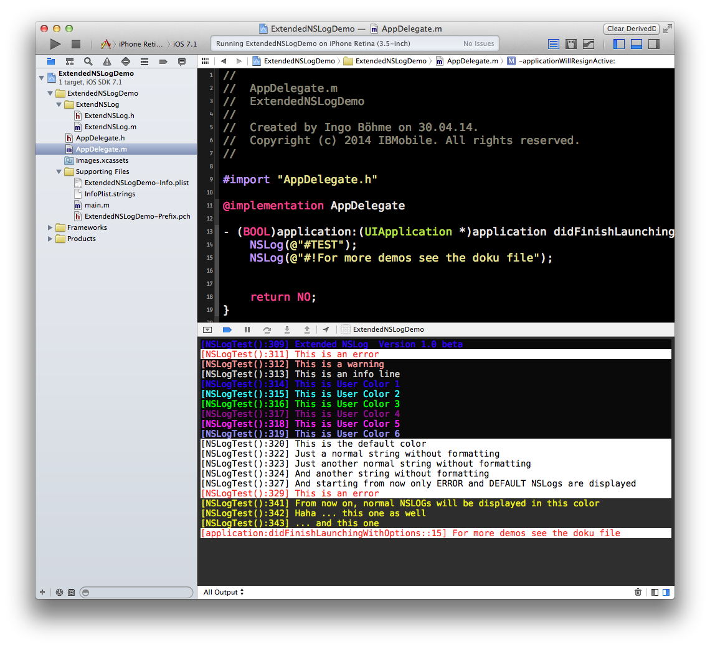

ExtendNSLog
=========

This is an extension for normal NSLog that controls layout, colors and additional information without changing the NSLog command to ALOG, BLOG, DEBLOG or whatever. If the ExtendNSLog is missing somewhere ... well, that´s OK. Else you get an output like that:

Usage
-------

Once you have included the files (ExtendNSLog.h and ExtendNSLog.m) I recommend that you include them in your YOURAPPLICATION-Prefix.pch    
    
Just insert the line    
`#import "ExtendNSLog.h"`    
     
then your Prefix file should look a bit like that     

 
`#import <Availability.h>`        
    
`#ifndef __IPHONE_3_0`        
`   #warning "This project uses features only available in iOS SDK 3.0 and later."`    
`#endif`    
    
`#ifdef __OBJC__`          
`   #import <UIKit/UIKit.h>`    
`   #import <Foundation/Foundation.h>`    
`   #import "ExtendNSLog.h"`       
` #endif`    

This enables all of your code to reformat the NSLog output you already have in your code without changing a single line of code.

To use the color functionality for the Xcode console, you have to include the Plugin XCodeColors ([https://github.com/robbiehanson/XcodeColors](https://github.com/robbiehanson/XcodeColors)). Just download the ZIP of the project and build it in XCode. Then restart Xcode.

How it works
------------   

If your NSLog output starts with a #, the next signs are interpreted as a display command.

 All commands begin with a \#, i.e.

    NSLog(@"\#COLOR:%@", NSLOG_USER1_COLOR);  // Set User color for normal output in USER1_COLOR

 or

    NSLog(@"\#!Print this line in the %@", @"error color");

Color Commands
--------------

***command	description***     
**#!**	this single Output is displayed in the error color

**#?**	this single Output is displayed in the warning color

**#.**	this single Output is displayed in the info color

**#0**	this single Output is displayed in the default color

**#1..#6**	this single Output is displayed in the NSLOG_USER_1 (..6) color
 

Special commands
----------------

These commands toggle the display until they are dis-/re-activated     

***command	description***

\#**SHOWFILENAME**	displays the .m filename before the output              

\#**SHOWFUNCTIONNAME**  displays the methodname before the output                

\#**SHOWLINENUMBER**    displays the line number before the output         

\#**HIDEFILENAME**      hides the .m filename before the output             

\#**HIDEFUNCTIONNAME**  hides the methodname before the output                

\#**HIDELINENUMBER**    hides the line number before the output                   

\#**LOGTOFILE**	sends logging to a file named console.log in the users filesystem. This is always on if the user is not attached to an xcode/simulator system. Good for getting infos from a remote user/tester              

\#**TEST**	Displays several output variants with the extended NSLog functionality            

\#**CLEAR**	Delets the logging file and restarts again / clears the screen          

\#**NSLOGINFO**	Shows general loggin information      

\#**TIMESTAMP**	prints a timestamp       

\#**-**	print a new (empty) line       

\#**DISPLAYONLY xx**  display only NSLog commands that match the state xx, i.e.  
`NSLog(@"#DISPLAYONLY %d", NSLOG_WARNING + NSLOG_USER1);        `  
 

NSLog Samples
--------------
    NSLog(@"#HidEFILENAME");
    NSLog(@"#1Extended NSLog  Version %@", EXTENDEDNSLOGVERSION);
    NSLog(@"#!This is an error");
    NSLog(@"#?This is a warning");
    NSLog(@"#.This is an info line");
    NSLog(@"#1This is User Color 1");
    NSLog(@"#2This is User Color 2");
    NSLog(@"#3This is User Color 3");
    NSLog(@"#4This is User Color 4");
    NSLog(@"#5This is User Color 5");
    NSLog(@"#6This is User Color 6");
    NSLog(@"#0This is the default color ");
    NSLog(@"Just a normal string without formatting");
    NSLog(@"Just another normal string without formatting");
    NSLog(@"And another string without formatting");
    NSLog(@"#DISPLAYONLY: %d", NSLOG_ERROR | NSLOG_DEFAULT);
    
    NSLog(@"And starting from now only ERROR and DEFAULT NSLogs are displayed");
    NSLog(@"#!This is an error");
    NSLog(@"#?This is a warning");
    NSLog(@"#.This is an info line");
    NSLog(@"#1This is User Color 1");
    
    
    NSLog(@"#-"); /// just an empty line
    NSLog(@"#FOREGROUND: %@", @"00EEEE");
    NSLog(@"#BACKGROUND: %@", @"222222");
    NSLog(@"From now on, normal NSLOGs will be displayed in this color");
 
 
 
 
this code will result in the following output 

 

